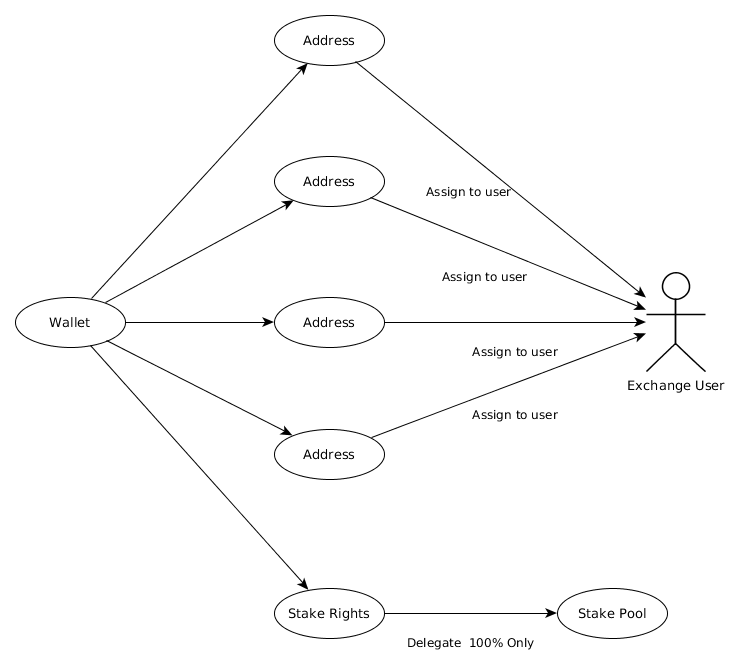
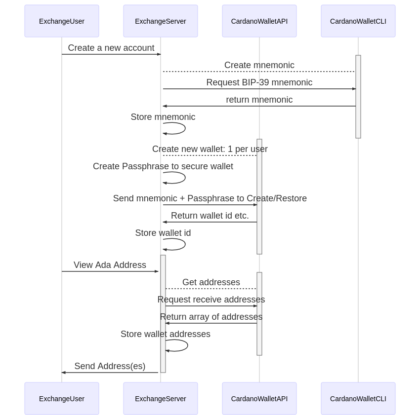
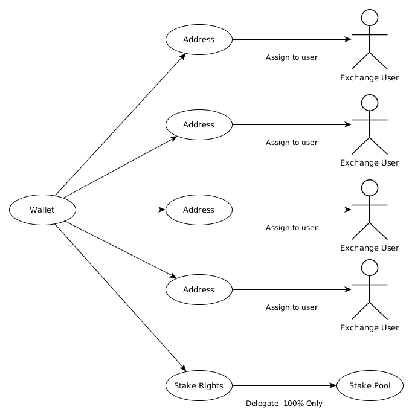
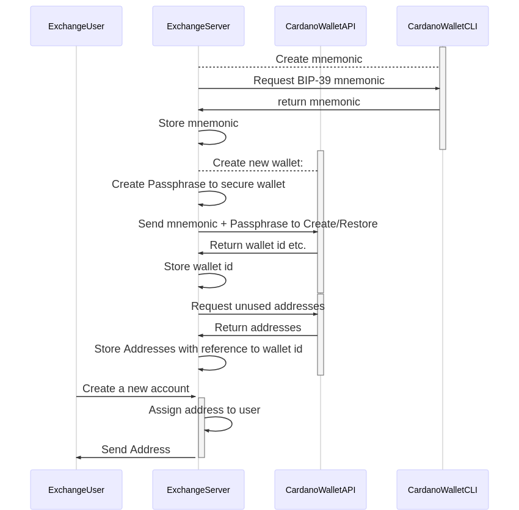
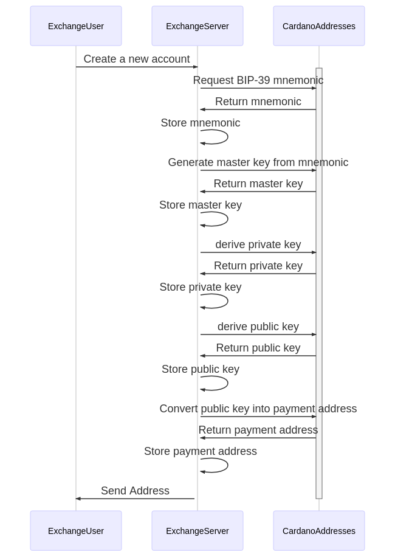
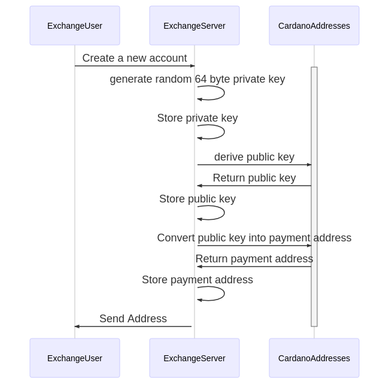

## Overview
NB! Only those examples relating to the Byron Reboot are currently covered here. Although the endpoints are much the same, concrete Shelley examples will be provided nearer the launch date. Some examples from Cardano SL will also be provided for the sake of comparison and migration.

Three main use cases will be covered here.
- One wallet with multiple addresses per user
- One wallet for multiple users
- Addresses without the use of cardano-wallet
- Migrating from Cardano SL to Byron Reboot and Shelley Addresses

## One wallet with multiple addresses per user




This is the default way to use cardano-wallet.
In this scenario the Exchange will create one wallet per user. That wallet can have multiple addresses that are all generated from the master key which itself is generated from a mnemonic.  




### Introduction
This section will provide testnet examples on generating a wallet and addresses using cardano-wallet API and CLI.

The benefits of using this method are:
- Rest API for easy integration
- Multiple addresses per user via Hierarchical Deterministic Wallet
- A combined balance is easily retrieved
- Transactions are simplified
- Stake delegation per user is feasible

One thing to note when using this method is that it cannot scale to large numbers of wallets, i.e. 10000 wallets connected to one node would overwhelm the node with connections and data. Further to this, one of the limitations of Hierarchical Deterministic Wallets that follow the [BIP-44](https://github.com/bitcoin/bips/blob/master/bip-0044.mediawiki) specification is that only a limited number of unused addresses are derived initially, this is based on the "Address gap limit" which is typically set to 20.


#### Generate BIP-39 mnemonic words (Byron Reboot)
This functionality is currently not available via the API so in order to do this programmatically either use the cardano-wallet CLI or cardano-addresses library. For manual generation, Daedalus wallet can be used. For demonstration purposes here we will use cardano-wallet CLI.

[//]: # (docker exec cardano-wallet_cardano-wallet_1 cardano-wallet-byron mnemonic generate --size 12)
```console
$ cardano-wallet-byron mnemonic generate --size 12
soldier rubber believe repair install forward ensure feel blanket soda soccer noise
```
The mnemonic returned (`soldier rubber believe repair install forward ensure feel blanket soda soccer noise`) should be stored securely as it may be used to restore the wallet and addresses if something goes wrong. Note the order of the words matters, they should be stored exactly as they appear.  


#### Restore mnemonic to wallet (Byron Reboot)
The default wallet "style" to use during the Byron Reboot phase is "random". In the Shelley era this will no longer be available and only [Hierarchical Deterministic Wallets](key-concepts/hierarchical-deterministic-wallets/) will be available.

Note that creating and restoring a wallet are the same function technically.

```console
$ curl -H "Content-Type: application/json" -d '{"name":"MyByronTestnetWallet","mnemonic_sentence":["soldier","rubber","believe","repair","install","forward","ensure","feel","blanket","soda","soccer","noise"],"passphrase":"MyVerySecurePassphrase","style":"random"}' -X POST http://localhost:8090/v2/byron-wallets
{
  "passphrase": {
    "last_updated_at": "2020-05-18T22:07:48.997760237Z"
  },
  "state": {
    "status": "syncing",
    "progress": {
      "quantity": 0,
      "unit": "percent"
    }
  },
  "discovery": "random",
  "balance": {
    "total": {
      "quantity": 0,
      "unit": "lovelace"
    },
    "available": {
      "quantity": 0,
      "unit": "lovelace"
    }
  },
  "name": "MyByronTestnetWallet",
  "id": "9450c1d184dc0f8f9a27d8ddf3f69b3b1633e44d",
  "tip": {
    "height": {
      "quantity": 0,
      "unit": "block"
    },
    "epoch_number": 0,
    "slot_number": 0
  }
}
```
The wallet id that is returned `9450c1d184dc0f8f9a27d8ddf3f69b3b1633e44d`, this should be stored along with the mnemonic for the associated user account.
The unit of Ada returned is "lovelace", there are one million lovelace in one Ada.

[//]: # (@TODO NB! Shelley Example to come! )


#### View wallet information:

```console
$ curl http://localhost:8090/v2/byron-wallets/9450c1d184dc0f8f9a27d8ddf3f69b3b1633e44d
{
  "passphrase": {
    "last_updated_at": "2020-05-18T22:07:48.997760237Z"
  },
  "state": {
    "status": "syncing",
    "progress": {
      "quantity": 79.31,
      "unit": "percent"
    }
  },
  "discovery": "random",
  "balance": {
    "total": {
      "quantity": 0,
      "unit": "lovelace"
    },
    "available": {
      "quantity": 0,
      "unit": "lovelace"
    }
  },
  "name": "MyByronTestnetWallet",
  "id": "9450c1d184dc0f8f9a27d8ddf3f69b3b1633e44d",
  "tip": {
    "height": {
      "quantity": 1023777,
      "unit": "block"
    },
    "epoch_number": 47,
    "slot_number": 9720
  }
}
```
The above response shows that the node is still synchronizing with the network, 79.31% completed.

#### Create new address for this wallet
```console
$ curl -H "Content-Type: application/json" -d '{"passphrase":"MyVerySecurePassphrase"}' -X PST http://localhost:8090/v2/byron-wallets/9450c1d184dc0f8f9a27d8ddf3f69b3b1633e44d/addresses
{
  "state": "unused",
  "id": "37btjrVyb4KEgngkooegdmhKTo8gpaprBgYepG9wpSRN14RAExiN3tfH7ENemtpAAfiJPBiCyY1uD9trYcqmGxyyMZCe1Xt4WwXYRdDoKdQbWzQemE"
}
```
When the wallet was created/restored the style used was "random", as such when the above request is made, one address is returned.


#### List addresses
```console
$ curl http://localhost:8090/v2/byron-wallets/9450c1d184dc0f8f9a27d8ddf3f69b3b1633e44d/addresses
[
  {
    "state": "unused",
    "id": "37btjrVyb4KEgngkooegdmhKTo8gpaprBgYepG9wpSRN14RAExiN3tfH7ENemtpAAfiJPBiCyY1uD9trYcqmGxyyMZCe1Xt4WwXYRdDoKdQbWzQemE"
  }
]
```

#### View updated wallet information:
Here we see the wallet information after the node has fully synchronized with the network and some testnet Ada have been sent to the address:

 `37btjrVyb4KEgngkooegdmhKTo8gpaprBgYepG9wpSRN14RAExiN3tfH7ENemtpAAfiJPBiCyY1uD9trYcqmGxyyMZCe1Xt4WwXYRdDoKdQbWzQemE`

```console
$ curl http://localhost:8090/v2/byron-wallets/9450c1d184dc0f8f9a27d8ddf3f69b3b1633e44d
{
  "passphrase": {
    "last_updated_at": "2020-05-18T22:07:48.997760237Z"
  },
  "state": {
    "status": "ready"
  },
  "discovery": "random",
  "balance": {
    "total": {
      "quantity": 673305344,
      "unit": "lovelace"
    },
    "available": {
      "quantity": 673305344,
      "unit": "lovelace"
    }
  },
  "name": "MyByronTestnetWallet",
  "id": "9450c1d184dc0f8f9a27d8ddf3f69b3b1633e44d",
  "tip": {
    "height": {
      "quantity": 1290933,
      "unit": "block"
    },
    "epoch_number": 59,
    "slot_number": 17682
  }
}

```


## One wallet for multiple users



NB!
- One of the limitations of Hierarchical Deterministic Wallets that follow the [BIP-44](https://github.com/bitcoin/bips/blob/master/bip-0044.mediawiki) specification is that only a limited number of unused addresses are derived initially, this is based on the "Address gap limit" which is typically set to 20.
- When delegating stake via cardano-wallet in this scenario the combined stake of all the wallet's address is delegated to the stake pool. Partial delegation is not feasible.

Note that the "Address gap limit", mentioned above, will restrict the number of unused addresses returned by the wallet. So, if the wallet initially derives 20 addresses and they are assigned to 20 users, no new addresses will be returned by the wallet until at least one of the addresses is used.   




#### Generate BIP-39 mnemonic words (Byron Reboot -HD)
This functionality is currently not available via the API so in order to do this programmatically either use the cardano-wallet CLI or cardano-addresses library. For manual generation, Daedalus wallet can be used. For demonstration purposes here we will use cardano-wallet CLI.

Contrary to the example above we will restore a Byron HD wallet for this example, in order to demonstrate how HD wallets will function in the Shelley era.

[//]: # (docker exec cardano-wallet_cardano-wallet_1 cardano-wallet-byron mnemonic generate)
```console
$ cardano-wallet-byron mnemonic generate
afford concert reduce doctor sting sell minimum mystery file rival extend drift smart leg bomb
```
The mnemonic returned (`afford concert reduce doctor sting sell minimum mystery file rival extend drift smart leg bomb`) should be stored securely as it may be used to restore the wallet and addresses if something goes wrong and the local instance is destroyed. Note the order of the words matters, they should be stored exactly as they appear.

#### Restore mnemonic to wallet (Byron Reboot)
The default wallet "style" to use during the Byron Reboot phase is "random". For the  Shelley phase this will no longer be available and only [Hierarchical Deterministic Wallets](key-concepts/hierarchical-deterministic-wallets/) will be available.


```console
$ curl -H "Content-Type: application/json" -d '{"name":"ExchangeTestnetWallet","mnemonic_sentence":["afford","concert","reduce","doctor","sting","sell","minimum","mystery","file","rival","extend","drift","smart","leg","bomb"],"passphrase":"MyVerySecurePassphrase","style":"ledger"}' -X POST http://localhost:8090/v2/byron-wallets
{
  "passphrase": {
    "last_updated_at": "2020-05-25T13:17:43.229787582Z"
  },
  "state": {
    "status": "syncing",
    "progress": {
      "quantity": 0,
      "unit": "percent"
    }
  },
  "discovery": "sequential",
  "balance": {
    "total": {
      "quantity": 0,
      "unit": "lovelace"
    },
    "available": {
      "quantity": 0,
      "unit": "lovelace"
    }
  },
  "name": "ExchangeTestnetWallet",
  "id": "35e79851d556bf93a110cacf0497c15ccb014c68",
  "tip": {
    "height": {
      "quantity": 0,
      "unit": "block"
    },
    "epoch_number": 0,
    "slot_number": 0
  }
}
```
Note the wallet id that is returned `35e79851d556bf93a110cacf0497c15ccb014c68`, this should be stored along with the mnemonic for the associated user account.

[//]: # (@TODO NB! Shelley Example to come! )


#### View wallet information:

```console
$ curl http://localhost:8090/v2/byron-wallets/35e79851d556bf93a110cacf0497c15ccb014c68

{
  "passphrase": {
    "last_updated_at": "2020-05-25T13:17:43.229787582Z"
  },
  "state": {
    "status": "syncing",
    "progress": {
      "quantity": 99.88,
      "unit": "percent"
    }
  },
  "discovery": "sequential",
  "balance": {
    "total": {
      "quantity": 0,
      "unit": "lovelace"
    },
    "available": {
      "quantity": 0,
      "unit": "lovelace"
    }
  },
  "name": "ExchangeTestnetWallet",
  "id": "35e79851d556bf93a110cacf0497c15ccb014c68",
  "tip": {
    "height": {
      "quantity": 1317907,
      "unit": "block"
    },
    "epoch_number": 61,
    "slot_number": 1456
  }
}


```
Note that the above response shows that the node is still synchronizing with the network.

#### Create new address for this wallet
```console
$ curl -H "Content-Type: application/json" -d '{"passphrase":"MyVerySecurePassphrase"}' -X PST http://localhost:8090/v2/byron-wallets/35e79851d556bf93a110cacf0497c15ccb014c68/addresses


```
#### List addresses
```console
$ curl http://localhost:8090/v2/byron-wallets/35e79851d556bf93a110cacf0497c15ccb014c68/addresses
[
  {
    "state": "unused",
    "id": "2cWKMJemoBamP7pNq8BC9zXKZVmgXBvNVMBiLPzPggn4yHza3vJT99dqdbzzs8CQFWEq3"
  },
  {
    "state": "unused",
    "id": "2cWKMJemoBamNFCvLkTjTC9hYANeHF83KWGzQLPxmUBZjmjVnTv5VvgcJmpe1R2ghFjSb"
  },
  {
    "state": "unused",
    "id": "2cWKMJemoBakytHZ6uAo6rjN9v15gGPFiPbWCToUpKr3QneytQEQNavEKXvAwdPxDM7in"
  },
  {
    "state": "unused",
    "id": "2cWKMJemoBam8SDZ6KVkpmN4GL2TdYxijEJ8PvgoRDu1FaLubWFftSTGFus2dsJot647d"
  },
  {
    "state": "unused",
    "id": "2cWKMJemoBajYa1rNhrf5n4CAVTRKU76yG8VoDw9P3RXwKBFvWqRyx9cLREuxsEAGcdL5"
  },
  {
    "state": "unused",
    "id": "2cWKMJemoBakL1Xy5wqSrSGEbJkvodfu93kyaV5jfZN4RmWkqzZbaFyYWTW6JCJMgqgjK"
  },
  {
    "state": "unused",
    "id": "2cWKMJemoBahojnApfT5PciM9vH53PTdbmakCU9pFXuRFhwV27ztaoH1MQfnEX4U9Z33u"
  },
  {
    "state": "unused",
    "id": "2cWKMJemoBakyzdfqQXCXvnxCCA9A3ZEigyxXrewq1Nn9HtaeK3upAMmuTs9wgujMLeHB"
  },
  {
    "state": "unused",
    "id": "2cWKMJemoBai3eYhhbDAFkrzkt2e9fXrNZwremiRBA6y8uXR86cEH2gNfoj15TWUf1zt5"
  },
  {
    "state": "unused",
    "id": "2cWKMJemoBaiXtVNWLXuivYBvWtkP5WF3HrEUzbWbn9ebALRezMfCTtgfrHEHdqF1kk7q"
  },
  {
    "state": "unused",
    "id": "2cWKMJemoBaia1nuTXRo9ZJYJWFTPkrUNWZNoBPSJux2hqc9DF2xwvQgYRJXQYUa6Grye"
  },
  {
    "state": "unused",
    "id": "2cWKMJemoBahV6g25jfahUkpL2cTJ5mn761ZhGBVNSmQ7kz7RAKxNGN6f5jgtsvYZ6pA7"
  },
  {
    "state": "unused",
    "id": "2cWKMJemoBaksZDg63nRUepeQuN2T5oAik8UVu4FFEKyGeqUxrAVuXUwph59uoMiYgj3V"
  },
  {
    "state": "unused",
    "id": "2cWKMJemoBajzRjA6trtpcDDzeTWyifEMe47C3V41urQPbddoTzQE9h9kCRkkY1HS8umV"
  },
  {
    "state": "unused",
    "id": "2cWKMJemoBak59vpgu7UgeM1YrFtEMisJeZpuKLDeqJ68TYV9peNsnXYJxL4qvf91SnhV"
  },
  {
    "state": "unused",
    "id": "2cWKMJemoBaj6a88J5irMFhQSrQQzYuiQaUZ8XpM5YhKE3dgfVNW14u5fajyQhR684Tcz"
  },
  {
    "state": "unused",
    "id": "2cWKMJemoBaiYN8Z1JiNb2T6h6eBMYKJvmfRUZu6viDQwZtpSwUiqaMNpe9pGerAhLgDb"
  },
  {
    "state": "unused",
    "id": "2cWKMJemoBaioQbjyJC71s5a5n2dTC9nPVXeXKtobZteZ2Cc3yotEkVzsykDqFzppjXLH"
  },
  {
    "state": "unused",
    "id": "2cWKMJemoBakhLRTLs2oZ83tRkw3sUmU7gRt1WVdsyQRjVLEoYQJi5X3vSFmRT6CE5kWH"
  },
  {
    "state": "unused",
    "id": "2cWKMJemoBajX9ZY3ZtoNQqG9eZsQKLEFqKzmg4AmyA4iGBJJgzWQein28RLNc3jVbBTE"
  }
]
```

#### View updated wallet information:
Here we see the wallet information after the wallet has fully synchronized with the network and some testnet Ada have been sent to the address:

 `37btjrVyb4KEgngkooegdmhKTo8gpaprBgYepG9wpSRN14RAExiN3tfH7ENemtpAAfiJPBiCyY1uD9trYcqmGxyyMZCe1Xt4WwXYRdDoKdQbWzQemE`

```console
$ curl http://localhost:8090/v2/byron-wallets/35e79851d556bf93a110cacf0497c15ccb014c68
{
  "passphrase": {
    "last_updated_at": "2020-05-25T13:17:43.229787582Z"
  },
  "state": {
    "status": "syncing",
    "progress": {
      "quantity": 100,
      "unit": "percent"
    }
  },
  "discovery": "sequential",
  "balance": {
    "total": {
      "quantity": 1000000,
      "unit": "lovelace"
    },
    "available": {
      "quantity": 1000000,
      "unit": "lovelace"
    }
  },
  "name": "ExchangeTestnetWallet",
  "id": "35e79851d556bf93a110cacf0497c15ccb014c68",
  "tip": {
    "height": {
      "quantity": 1319650,
      "unit": "block"
    },
    "epoch_number": 61,
    "slot_number": 3199
  }
}
```

#### List addresses after receiving funds
```console
$ curl http://localhost:8090/v2/byron-wallets/35e79851d556bf93a110cacf0497c15ccb014c68/addresses
[
  {
    "state": "used",
    "id": "2cWKMJemoBamP7pNq8BC9zXKZVmgXBvNVMBiLPzPggn4yHza3vJT99dqdbzzs8CQFWEq3"
  },
  {
    "state": "unused",
    "id": "2cWKMJemoBamNFCvLkTjTC9hYANeHF83KWGzQLPxmUBZjmjVnTv5VvgcJmpe1R2ghFjSb"
  },
  {
    "state": "unused",
    "id": "2cWKMJemoBakytHZ6uAo6rjN9v15gGPFiPbWCToUpKr3QneytQEQNavEKXvAwdPxDM7in"
  },
  {
    "state": "unused",
    "id": "2cWKMJemoBam8SDZ6KVkpmN4GL2TdYxijEJ8PvgoRDu1FaLubWFftSTGFus2dsJot647d"
  },
  {
    "state": "unused",
    "id": "2cWKMJemoBajYa1rNhrf5n4CAVTRKU76yG8VoDw9P3RXwKBFvWqRyx9cLREuxsEAGcdL5"
  },
  {
    "state": "unused",
    "id": "2cWKMJemoBakL1Xy5wqSrSGEbJkvodfu93kyaV5jfZN4RmWkqzZbaFyYWTW6JCJMgqgjK"
  },
  {
    "state": "unused",
    "id": "2cWKMJemoBahojnApfT5PciM9vH53PTdbmakCU9pFXuRFhwV27ztaoH1MQfnEX4U9Z33u"
  },
  {
    "state": "unused",
    "id": "2cWKMJemoBakyzdfqQXCXvnxCCA9A3ZEigyxXrewq1Nn9HtaeK3upAMmuTs9wgujMLeHB"
  },
  {
    "state": "unused",
    "id": "2cWKMJemoBai3eYhhbDAFkrzkt2e9fXrNZwremiRBA6y8uXR86cEH2gNfoj15TWUf1zt5"
  },
  {
    "state": "unused",
    "id": "2cWKMJemoBaiXtVNWLXuivYBvWtkP5WF3HrEUzbWbn9ebALRezMfCTtgfrHEHdqF1kk7q"
  },
  {
    "state": "unused",
    "id": "2cWKMJemoBaia1nuTXRo9ZJYJWFTPkrUNWZNoBPSJux2hqc9DF2xwvQgYRJXQYUa6Grye"
  },
  {
    "state": "unused",
    "id": "2cWKMJemoBahV6g25jfahUkpL2cTJ5mn761ZhGBVNSmQ7kz7RAKxNGN6f5jgtsvYZ6pA7"
  },
  {
    "state": "unused",
    "id": "2cWKMJemoBaksZDg63nRUepeQuN2T5oAik8UVu4FFEKyGeqUxrAVuXUwph59uoMiYgj3V"
  },
  {
    "state": "unused",
    "id": "2cWKMJemoBajzRjA6trtpcDDzeTWyifEMe47C3V41urQPbddoTzQE9h9kCRkkY1HS8umV"
  },
  {
    "state": "unused",
    "id": "2cWKMJemoBak59vpgu7UgeM1YrFtEMisJeZpuKLDeqJ68TYV9peNsnXYJxL4qvf91SnhV"
  },
  {
    "state": "unused",
    "id": "2cWKMJemoBaj6a88J5irMFhQSrQQzYuiQaUZ8XpM5YhKE3dgfVNW14u5fajyQhR684Tcz"
  },
  {
    "state": "unused",
    "id": "2cWKMJemoBaiYN8Z1JiNb2T6h6eBMYKJvmfRUZu6viDQwZtpSwUiqaMNpe9pGerAhLgDb"
  },
  {
    "state": "unused",
    "id": "2cWKMJemoBaioQbjyJC71s5a5n2dTC9nPVXeXKtobZteZ2Cc3yotEkVzsykDqFzppjXLH"
  },
  {
    "state": "unused",
    "id": "2cWKMJemoBakhLRTLs2oZ83tRkw3sUmU7gRt1WVdsyQRjVLEoYQJi5X3vSFmRT6CE5kWH"
  },
  {
    "state": "unused",
    "id": "2cWKMJemoBajX9ZY3ZtoNQqG9eZsQKLEFqKzmg4AmyA4iGBJJgzWQein28RLNc3jVbBTE"
  },
  {
    "state": "unused",
    "id": "2cWKMJemoBajfX9V6onfGLmw2RMUKA3Eq5cyw2WvisBy3BHVzpwRLrNcYNrHx2zVfxeAT"
  }
]
```
If we compare this response with the previous one we can see that once Ada was received by the first address it was marked as `used` and a new address(`2cWKMJemoBajfX9V6onfGLmw2RMUKA3Eq5cyw2WvisBy3BHVzpwRLrNcYNrHx2zVfxeAT`) was appended to the list.


## Addresses without the use of cardano-wallet (Shelley specific)

If `cardano-wallet` is not compatible with an integration plan and wallet/address management functionality already exists then using cardano-address is the appropriate approach to take.


### Mnemonic seed method

This method has the added advantage that it uses a mnemonic as its starting point. If the wallet ever needs to be recovered manually in cardano-wallet, Daedalus or Yoroi this makes it very easy to do so. However it does require more steps and also requires more private data to be managed and stored.  


[//]: # (@TODO NB! CLI examples to be added once the CLI has been completed.)

#### Generate mnemonic
```console
$ cardano-address recovery-phrase generate --size 15 > mnemonic.prv

$ cat mnemonic.prv
canal clock monster observe there fever urban shine enforce lake trust strike rubber cake smile

```

#### Generate the root private key - Shelley Testnet
```console
$ cat mnemonic.prv | cardano-address key from-recovery-phrase Shelley > root.prv
$ cat root.prv
xprv1lrdzmaenck2j7syh90spwkrulfjt85jmlpusxswl09e9jygw33w3upqrr3k0ajs87qc72da4y68ptladc5ess3xtad9m48490sld9luxe24el8naa62hadqn53wuej6xc87vmd0ch3d3ua37mtrd6dz3u5mmu0h4
```

#### Generate a delegation key and private key - Shelley Testnet
```console
$ cat root.prv | cardano-address key child 1852H/1815H/0H/2/0 > stake.prv
$ cat stake.prv
xprv18zsrgmcvc67tvagdph94zp74pjfmzyapxvpad0hdj22hvdgw33w3eh3tpncfqr32ys9t263t823j6h0w7v6qg3q8fk5my6ulzwzr0qpwftcd8dmzvlagfmqmxfmh72pe58rllxxwv9y5j08jkgj5jgl0rvgpe9la

$ cat root.prv | cardano-address key child 1852H/1815H/0H/0/0 > addr.prv
$ cat addr.prv
xprv1wpyd0kccn7vc0kr8nutgyjmqu9tk8zxcayc269wsqnzh52sw33wlqnp2dv5q0zmcz3tq4wqsxeyu4j3sk0h63w7yfakd0qtud3kep0h4kqkckuzmpwznnl8u78tcs2gp6e0kjtk7yeppqepcdt34eghj0s56gtls
```
Note the difference between 1852H/1815H/0H/`2`/0 and 1852H/1815H/0H/`0`/0, `2` to indicate a reward account address, used for delegation, whereas `0` indicates an address on the external chain.

#### Generate public and payment address - Shelley Testnet
```console
$ cat addr.prv | cardano-address key public > addr.pub
$ cat addr.pub
xpub16cv3r5pxe38njnatduavtf6rkkzrcdf4ayl6hv5cyhgvyskgu7mltvpd3dc9kzu98870euwh3q5sr4jldyhdufjzzpjrs6hrtj30ylqw2v4r0

$ cat addr.pub | ./cardano-address address payment --network-tag 0 > addr.pay
$ cat addr.pay
addr1vrp7jdfjeclnmrqmaehklwfmkje6su4kjek9c7z58p7gmlg9jqpt4
```
Here we see that `--network-tag` is set to `0`, this denotes the testnet, whereas `1` would be used for the mainnet.

#### Derive a second address - Shelley Testnet
```console
$ cat root.prv | cardano-address key child 1852H/1815H/0H/2/1 > stake1.prv
$ cat stake1.prv
xprv1ap6sta593zp68my8lkuqhvc244xu33gyv86qk3gr54wscdsw33whqtchvexeafgkawzclsceph79wmcu5tj07mul9unfxnzsgaw48w2x63p5502kyaevz6z33rw9z20pkd46lghxfmkvw2pn2k76z8mk7skf4v6j

$ cat stake1.prv | cardano-address key public
$ cat stake1.pub
xpub1tm6gdt2cqe54rq9wt6gw6n9zpf6aqt9lvp39za4u8nlzmzqpf2hyd4zrfg74vfmjc959rzxu2y57rvmt473wvnhvcu5rx4da5y0hdaqsnt7uu

$ cat root.prv | cardano-address key child 1852H/1815H/0H/0/1 > addr1.prv
$ cat addr1.prv
xprv1czkqqkv7w4fv5ld58kaaapvk6fexyq9c64nkns3a5dpdk2cw33wlyjhx2rsgqj54l6v4vxfhak0mc3phzkwh467knkl72q244d5qu4hswmvfy9tyj0te6n5vu05f5rjs8qyqqlk00ed48wj7lcumxw9fdcmuyuxu
$ cat addr1.prv | cardano-address key public > addr1.pub
$ cat addr1.pub
xpub147ps0a2zx2gq65s2h3h2rtq7zlm897rw3ce49fqfczxxt6l4tc70qakcjg2kfy7hn48geclgng89qwqgqplv7ljm2wa9al3ekvu2jms625ssd
$ cat addr1.pub | ./cardano-address address payment --network-tag 0 > addr1.pay
$ cat addr1.pay
addr1vrpx27s7e05h2lshxwj20dgplgrfzmwcaqjx2yyu7vu90ygjqv2jc
```
We use the same root key here to derive more private keys.

#### Derive new keys in accounts - Shelley Testnet
If we want to use accounts to derive a new set of keys we can increment the third path in `1852H/1815H/0H/2/0` so we have `1852H/1815H/1H/2/0`. This gives us (2^31 - 1) more derivable addresses.
```console
$ cat root.prv | cardano-address key child 1852H/1815H/1H/2/0 > ac1_stake.prv
$ cat ac1_stake.prv
xprv17p7a46hcgl7klvh6g5mz2tej50s02t8v2z8avg5sup7h5tgw33w7e2sqrauyeuf98myzpcwwt4d054ytjv3lhawrafkvc3c43zvvqtdn9nsctl838082spr795tad4vfvs6l667zyty87q5dq9ua9t8tlqx3m8ak
$ cat root.prv | cardano-address key child 1852H/1815H/1H/0/0 > ac1_addr.prv
$ cat ac1_addr.prv
xprv1hp42tsmd95dgxce0sf08mg69wternmr3vga0rhss93hqs2sw33wc60pqm8p6vasje6j5fwess22hxnwk0whpgcty6ymyaj6tlh55qcu8knua7gh2dtdzvm6t4khfd9dahlzg3rj6yn6vsnkheuvwlzwtzudsxwp8
$ cat ac1_addr.prv | cardano-address key public > ac1_addr.pub
$ cat ac1_addr.pub
xpub1w7kea70t2ghcfhujw388xq6jd6wrhtyx37fqd0p5vqe6zdfgaqsg0d8emu3w56k6yeh5htdwj62mm07y3z895f85ep8d0ncca7yuk9cttpvly
$ cat ac1_addr.pub | cardano-address address payment --network-tag 0 > ac1_addr_main.pay
$ cat ac1_addr.pay
addr1vph0rjhsw0a4u9s9kvwfdx5yp65zav45el78ltvflsv2cxghk0lht
```
#### Derive mainnet address
Following the above example if we want to generate a mainnet address we can change `--network-tag` to '1'.
```console
$ cat ac1_addr.pub | ./cardano-address address payment --network-tag 1 > ac1_addr_main.pay
$ cat ac1_addr_main.pay
addr1v9h0rjhsw0a4u9s9kvwfdx5yp65zav45el78ltvflsv2cxghylwhv
```
#### Validate address information
We can also check addresses we generated above to see information on them:
```console
$ cat ac1_addr_main.pay | cardano-address address inspect
address style:      Shelley
stake reference:    none
spending key hash:  6ef1caf073fb5e1605b31c969a840ea82eb2b4cffc7fad89fc18ac19
network tag:        1

$ cat addr1.pay | cardano-address address inspect
address style:      Shelley
stake reference:    none
spending key hash:  c2657a1ecbe9757e1733a4a7b501fa06916dd8e82465109cf3385791
network tag:        0

$ cat addr.pay | cardano-address address inspect
address style:      Shelley
stake reference:    none
spending key hash:  c3e93532ce3f3d8c1bee6f6fb93bb4b3a872b6966c5c7854387c8dfd
network tag:        0
```
Note that `stake reference` refers to the stake key of a pool operator.

If we submit an address that is not a well-formed address we will get an error:
```console
$ cat bad_addr.pay
je6su4kjek9c7z58p7gmlg9jqpt4

$ cat bad_addr.pay | cardano-address address inspect
user error (Couldn't detect input encoding? Data on stdin must be encoded as bech16, bech32 or base58.)

```

#### Generate Byron addresses

To generate a Bryon mainnet address:

```console
$ cardano-address recovery-phrase generate --size 12 > byron_mnemonic.prv
$ cat byron_mnemonic.prv
drastic next obscure flip recycle vapor frown public talent beyond elbow language

$ cat byron_mnemonic.prv | cardano-address key from-recovery-phrase Byron > byron_root.prv
$ cat byron_root.prv
xprv1jpgscha3s63ymzhlyzxeaur5tg6gnccc6f7qf5pgfv69x2gm5erkvkxvczl2yxg333yhwwncqcv25fw23ct6alw7x32lptk2gcnt7pdzeq9jmwhnewpdx6aft4ja6j7d3xxq7aptzkjryu293026n6zz0qqxxy33

$ cat byron_root.prv | cardano-address key child 14H/42H > byron_addr.prv
$ cat byron_addr.prv
xprv1fphmm0jh67vtegmgw9glsc0c934qgfjj5h3v5nvsmr3zzdgm5er4jnx7mdxmamr4rc9c4ca9hsyvxvhkwj9tvh4xr64xmyf6df74cnenzf05tyhnqwl98p9a36kh54pmzlylqur5ynka5rve9dc9rq0ua5tsvevr

# Get the hex representation of the private address for signing transactions later
$ cat byron_root.prv | ./cardano-address key child 14H/42H --base16 > byron_addr_hex.prv
$ cat byron_addr_hex.prv
486fbdbe57d798bca3687151f861f82c6a042652a5e2ca4d90d8e221351ba647594cdedb4dbeec751e0b8ae3a5bc08c332f6748ab65ea61eaa6d913a6a7d5c4f33125f4592f303be5384bd8ead7a543b17c9f0707424edda0d992b705181fced


$ cat byron_addr.prv | cardano-address key public > byron_addr.pub
$ cat byron_addr.pub
xpub1qrq40c29mr63cukfn7wfgvr7fgk5ccaqksanzet7cz2dt2v7zl4nxyjlgkf0xqa72wztmr4d0f2rk97f7pc8gf8dmgxej2ms2xqlemgdvr4ej

$ cat root.prv | cardano-address key public > byron_root_addr.pub
$ cat byron_root_addr.pub
xpub1fustch8590nrmdns3csl5twywtua8lhn8an59uyvnrhzkzvxgr2gdj4tn708mm54066p8fzaen95ds0uek6l30zmremrakkxm569regjv35tn

$ cat byron_addr.pub | cardano-address address bootstrap $(cat byron_root_addr.pub) --network-tag 764824073 --path 14H/42H > byron_addr.pay
cat byron_addr.pay
DdzFFzCqrhskAjmWewKzoTDiW7exmzvb6n93Gfp59QnAhGLscFaKH6VR81ShwJkAAAvuyzMEs9sdSU8ftTPAUcU72Az4DdK3kxVKzLV6

```

<!-- ### Private key seed method

This method could be considered the most appropriate when a large number of addresses need to be managed independently. Any random 64 bytes can be considered a private key and can be generated using typical random functions available in any programming language. Using this private key it is then possible to derive the public key and the payment address.


[//]: # (@TODO NB! CLI examples to be added once the CLI has been completed.) -->


## Migrating from Cardano SL to Byron Reboot and Shelley Addresses

Upgrading from Cardano SL to Adrestia is necessary to prevent an outage when the Byron era end and also to prepare for the Shelley era.
Byron Reboot facilitates the transition from Byron to Shelley.

Some points of note in relation to this upgrade.
- Byron era addresses will still work after the upgrade
- Stake delegation from Byron era addresses is NOT possible


#### Previous creation of Cardano Sl Wallet and Addresses

The following steps would have been used when creating a new wallet and addresses in Cardano SL. The easiest ways to move your wallet/funds from Cardano Sl to cardano-wallet are as follows:

- Use the mnemonic to create/restore the wallet in cardano-wallet. Then call the cardano-wallet `Import Address` endpoint to add the addresses that you used in Cardano SL to cardano-wallet. this is the procedure we will show below.
- Using the spending password, send the funds from your wallets/addresses to new addresses created in Cardano Wallet. This incurs network fees so it should be used as the last option.

The following was performed on Cardano `mainnet` and the mnemonic we will use to kick off our example is:
```console
sentence shiver lab engage plunge kite announce desert report smoke tenant item
```


```console
# CARDANO SL
$ curl -X POST https://localhost:8090/api/v1/wallets \
   -H "Accept: application/json; charset=utf-8" \
   -H "Content-Type: application/json; charset=utf-8" \
   --cert ./state-wallet-mainnet/tls/client/client.pem \
   --cacert ./state-wallet-mainnet/tls/client/ca.crt \
   -d '{
   "operation": "create",
   "backupPhrase": ["sentence","shiver","lab","engage","plunge","kite","announce","desert","report","smoke","tenant","item"],
   "assuranceLevel": "normal",
   "name": "MySLWallet",
   "spendingPassword": "df4a314dec4cd954b43e90e4f8411350df4a314dec4cd954b43e90e4f8411350"
 }' | jq

{
  "data": {
    "id": "Ae2tdPwUPEZ4SjNARyqC1skSFr2zBjXTMAJfREWhkcHnNv5LUC3vGmNH8Yv",
    "name": "MySLWallet",
    "balance": 0,
    "hasSpendingPassword": true,
    "spendingPasswordLastUpdate": "2020-06-09T11:57:51.316322",
    "createdAt": "2020-06-09T11:57:51.316322",
    "assuranceLevel": "normal",
    "syncState": {
      "tag": "synced",
      "data": null
    }
  },
  "status": "success",
  "meta": {
    "pagination": {
      "totalPages": 1,
      "page": 1,
      "perPage": 1,
      "totalEntries": 1
    }
  }
}

```
Note the wallet id is `Ae2tdPwUPEZ4SjNARyqC1skSFr2zBjXTMAJfREWhkcHnNv5LUC3vGmNH8Yv`.

Each wallet contains at least one account so lets get the account that was created for us.

```console
# CARDANO SL
$ curl -X GET https://localhost:8090/api/v1/wallets/Ae2tdPwUPEZ4SjNARyqC1skSFr2zBjXTMAJfREWhkcHnNv5LUC3vGmNH8Yv/accounts      -H "Accept: application/json; charset=utf-8"   --cert ./state-wallet-mainnet/tls/client/client.pem   --cacert ./state-wallet-mainnet/tls/client/ca.crt |jq

{
  "data": [
    {
      "index": 2147483648,
      "addresses": [
        {
          "id": "DdzFFzCqrhsxY4y6BC81XaF4tvmyLfQazrwzPh1LgsSn4tFc7N7TAKy2aLs5vUBGgHMmRUjwzBNCg5afk8VESUSTeLQXWzcu5tHKaZjr",
          "used": false,
          "changeAddress": false,
          "ownership": "isOurs"
        }
      ],
      "amount": 0,
      "name": "Account: HdAccountIx 2147483648",
      "walletId": "Ae2tdPwUPEZ4SjNARyqC1skSFr2zBjXTMAJfREWhkcHnNv5LUC3vGmNH8Yv"
    }
  ],
  "status": "success",
  "meta": {
    "pagination": {
      "totalPages": 1,
      "page": 1,
      "perPage": 10,
      "totalEntries": 1
    }
  }
}

```

Lets create a new address in this same account `2147483648`.

```console
# CARDANO SL
$ curl -X POST https://localhost:8090/api/v1/addresses \
     -H "Accept: application/json; charset=utf-8" \
  -H "Content-Type: application/json; charset=utf-8" \
  --cert ./state-wallet-mainnet/tls/client/client.pem \
  --cacert ./state-wallet-mainnet/tls/client/ca.crt \
  -d '{"accountIndex":2147483648,"spendingPassword":"df4a314dec4cd954b43e90e4f8411350df4a314dec4cd954b43e90e4f8411350","walletId":"Ae2tdPwUPEZ4SjNARyqC1skSFr2zBjXTMAJfREWhkcHnNv5LUC3vGmNH8Yv"}' | jq

  {
    "data": {
      "id": "DdzFFzCqrhsf9mokbqiCZNFdKwDbKHpExSbbtMQNb6jSgRTYXav5MgavroVWDR9UCAayRg7TfZ4dzhuditm5cDUm957hX7jcKNLvBj2g",
      "used": false,
      "changeAddress": false,
      "ownership": "isOurs"
    },
    "status": "success",
    "meta": {
      "pagination": {
        "totalPages": 1,
        "page": 1,
        "perPage": 1,
        "totalEntries": 1
      }
    }
  }

```
Verify that this new address `DdzFFzCqrhsf9mokbqiCZNFdKwDbKHpExSbbtMQNb6jSgRTYXav5MgavroVWDR9UCAayRg7TfZ4dzhuditm5cDUm957hX7jcKNLvBj2g` is now in our wallet:

```console
# CARDANO SL
$ curl -X GET https://localhost:8090/api/v1/wallets/Ae2tdPwUPEZ4SjNARyqC1skSFr2zBjXTMAJfREWhkcHnNv5LUC3vGmNH8Yv/accounts      -H "Accept: application/json; charset=utf-8"   --cert ./state-wallet-mainnet/tls/client/client.pem --cacert ./state-wallet-mainnet/tls/client/ca.crt |jq

{
  "data": [
    {
      "index": 2147483648,
      "addresses": [
        {
          "id": "DdzFFzCqrhsxY4y6BC81XaF4tvmyLfQazrwzPh1LgsSn4tFc7N7TAKy2aLs5vUBGgHMmRUjwzBNCg5afk8VESUSTeLQXWzcu5tHKaZjr",
          "used": false,
          "changeAddress": false,
          "ownership": "isOurs"
        },
        {
          "id": "DdzFFzCqrhsf9mokbqiCZNFdKwDbKHpExSbbtMQNb6jSgRTYXav5MgavroVWDR9UCAayRg7TfZ4dzhuditm5cDUm957hX7jcKNLvBj2g",
          "used": false,
          "changeAddress": false,
          "ownership": "isOurs"
        }
      ],
      "amount": 0,
      "name": "Account: HdAccountIx 2147483648",
      "walletId": "Ae2tdPwUPEZ4SjNARyqC1skSFr2zBjXTMAJfREWhkcHnNv5LUC3vGmNH8Yv"
    }
  ],
  "status": "success",
  "meta": {
    "pagination": {
      "totalPages": 1,
      "page": 1,
      "perPage": 10,
      "totalEntries": 1
    }
  }
}

```

Receive funds and check wallet and explorer:
10000 lovelace sent to the address `DdzFFzCqrhsxY4y6BC81XaF4tvmyLfQazrwzPh1LgsSn4tFc7N7TAKy2aLs5vUBGgHMmRUjwzBNCg5afk8VESUSTeLQXWzcu5tHKaZjr` from Daedalus. For the sake of overlapping technologies we will use cardano-rest explorer-api to check the "balance" of that address.

```console
# CARDANO-REST  
$ curl -X GET http://localhost:8100/api/addresses/summary/DdzFFzCqrhsxY4y6BC81XaF4tvmyLfQazrwzPh1LgsSn4tFc7N7TAKy2aLs5vUBGgHMmRUjwzBNCg5afk8VESUSTeLQXWzcu5tHKaZjr

{
  "Right": {
    "caAddress": "DdzFFzCqrhsxY4y6BC81XaF4tvmyLfQazrwzPh1LgsSn4tFc7N7TAKy2aLs5vUBGgHMmRUjwzBNCg5afk8VESUSTeLQXWzcu5tHKaZjr",
    "caType": "CPubKeyAddress",
    "caChainTip": {
      "ctBlockNo": 4334314,
      "ctSlotNo": 4336477,
      "ctBlockHash": "d8006975f0c2360aaee7c27557490cc710680075db6b8905b0d8d77a301df813"
    },
    "caTxNum": 1,
    "caBalance": {
      "getCoin": "10000"
    },
    "caTotalInput": {
      "getCoin": "10000"
    },
    "caTotalOutput": {
      "getCoin": "0"
    },
    "caTotalFee": {
      "getCoin": "170807"
    },
    "caTxList": [
      {
        "ctbId": "02ea412e49a28c38555ecb3396875ac4092e3ae7d502f79b7977cc564a94b7bf",
        "ctbTimeIssued": 1591712171,
        "ctbInputs": [
          {
            "ctaAddress": "DdzFFzCqrht73WEVPzafDBTAjJeyp6HiUxoqH3hLGV9PXFuGFXnaAYhaCvDjcKVn6kx729Mwc4W7cLXbhZEc4Kr4qvTDP8ByHkzaqmGc",
            "ctaAmount": {
              "getCoin": "827743"
            },
            "ctaTxHash": "9c370424f3b191e8f01dba73b7a5d21152f38b448134ed7fb5e3b1b56afd849d",
            "ctaTxIndex": 0
          }
        ],
        "ctbOutputs": [
          {
            "ctaAddress": "DdzFFzCqrhsk8qV56Wp7orANzzCuaDEomV85L19kUhBTyWmGSHq77hgEsVLKQE42yB9YjsovvgQWxafunAaZepAi8BHJ2f9A9vGbzx2t",
            "ctaAmount": {
              "getCoin": "646936"
            },
            "ctaTxHash": "02ea412e49a28c38555ecb3396875ac4092e3ae7d502f79b7977cc564a94b7bf",
            "ctaTxIndex": 1
          },
          {
            "ctaAddress": "DdzFFzCqrhsxY4y6BC81XaF4tvmyLfQazrwzPh1LgsSn4tFc7N7TAKy2aLs5vUBGgHMmRUjwzBNCg5afk8VESUSTeLQXWzcu5tHKaZjr",
            "ctaAmount": {
              "getCoin": "10000"
            },
            "ctaTxHash": "02ea412e49a28c38555ecb3396875ac4092e3ae7d502f79b7977cc564a94b7bf",
            "ctaTxIndex": 0
          }
        ],
        "ctbInputSum": {
          "getCoin": "827743"
        },
        "ctbOutputSum": {
          "getCoin": "656936"
        },
        "ctbFees": {
          "getCoin": "170807"
        }
      }
    ]
  }
}

```

Next we will restore the Cardano SL wallet that we just created in cardano-wallet. Note that the `style` is `random` and as such when we have restored it there will not be any addresses present. Those addresses will be imported in later steps.

```console
# CARDANO-WALLET
$ curl -H "Content-Type: application/json" -d '{"name":"ByronRestoredWallet","mnemonic_sentence":["sentence","shiver","lab","engage","plunge","kite","announce","desert","report","smoke","tenant","item"],"passphrase":"MyVerySecurePassphrase","style":"random"}' -X POST http://localhost:8090/v2/byron-wallets

{
  "passphrase": {
    "last_updated_at": "2020-06-23T16:46:18.836162083Z"
  },
  "state": {
    "status": "syncing",
    "progress": {
      "quantity": 0,
      "unit": "percent"
    }
  },
  "discovery": "random",
  "balance": {
    "total": {
      "quantity": 0,
      "unit": "lovelace"
    },
    "available": {
      "quantity": 0,
      "unit": "lovelace"
    }
  },
  "name": "ByronRestoredWallet",
  "id": "62e2b98de8e56f823b4e8d335221e349ee131771",
  "tip": {
    "height": {
      "quantity": 0,
      "unit": "block"
    },
    "epoch_number": 0,
    "slot_number": 0
  }
}

```

Now we can restore the addresses in cardano-wallet that we previously created in  Cardano SL.

```console
# CARDANO-WALLET
$ curl -X PUT http://localhost:8090/v2/byron-wallets/62e2b98de8e56f823b4e8d335221e349ee131771/addresses/DdzFFzCqrhsxY4y6BC81XaF4tvmyLfQazrwzPh1LgsSn4tFc7N7TAKy2aLs5vUBGgHMmRUjwzBNCg5afk8VESUSTeLQXWzcu5tHKaZjr

$ curl -X PUT http://localhost:8090/v2/byron-wallets/62e2b98de8e56f823b4e8d335221e349ee131771/addresses/DdzFFzCqrhsf9mokbqiCZNFdKwDbKHpExSbbtMQNb6jSgRTYXav5MgavroVWDR9UCAayRg7TfZ4dzhuditm5cDUm957hX7jcKNLvBj2g
```
Check the addresses were added to our Byron random wallet.
```console
# CARDANO-WALLET
$ curl http://localhost:8090/v2/byron-wallets/62e2b98de8e56f823b4e8d335221e349ee131771/addresses |jq
[
  {
    "state": "unused",
    "id": "DdzFFzCqrhsxY4y6BC81XaF4tvmyLfQazrwzPh1LgsSn4tFc7N7TAKy2aLs5vUBGgHMmRUjwzBNCg5afk8VESUSTeLQXWzcu5tHKaZjr"
  },
  {
    "state": "unused",
    "id": "DdzFFzCqrhsf9mokbqiCZNFdKwDbKHpExSbbtMQNb6jSgRTYXav5MgavroVWDR9UCAayRg7TfZ4dzhuditm5cDUm957hX7jcKNLvBj2g"
  }
]
```
Initially the addresses will be marked as `unused` but when the wallet synchronization is complete then we will see an updated status for the wallet we sent funds to.

Check the balance after it is finished synchronizing:

```console
# CARDANO-WALLET
$ curl http://localhost:8090/v2/byron-wallets/62e2b98de8e56f823b4e8d335221e349ee131771/addresses |jq
[
  {
    "state": "used",
    "id": "DdzFFzCqrhsxY4y6BC81XaF4tvmyLfQazrwzPh1LgsSn4tFc7N7TAKy2aLs5vUBGgHMmRUjwzBNCg5afk8VESUSTeLQXWzcu5tHKaZjr"
  },
  {
    "state": "unused",
    "id": "DdzFFzCqrhsf9mokbqiCZNFdKwDbKHpExSbbtMQNb6jSgRTYXav5MgavroVWDR9UCAayRg7TfZ4dzhuditm5cDUm957hX7jcKNLvBj2g"
  }
]

```

This completes out restoration of wallet and addresses from Cardano SL to cardano-wallet. One final point regarding this restoration, the addresses are still Byron addresses and cannot be used to delegate stake to a pool. To be able to delegate stake you must send your funds to a Shelley address.


[//]: # (## Bech32 Library)
